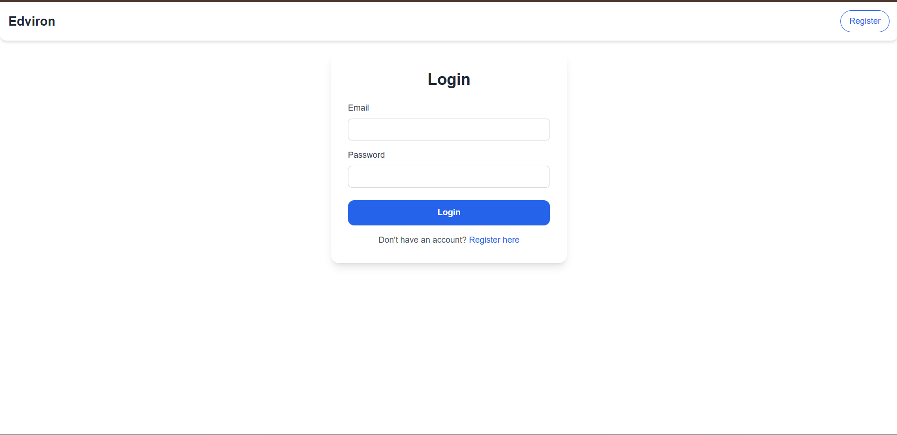
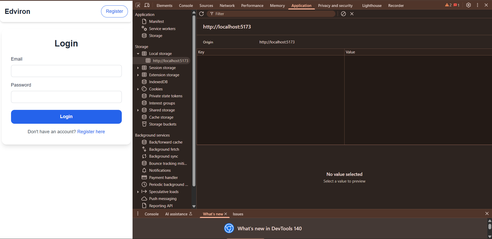
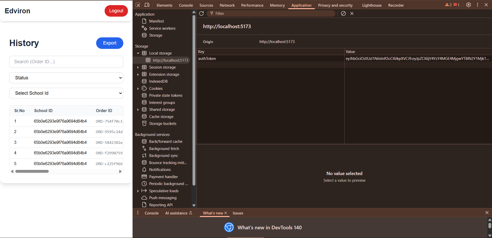
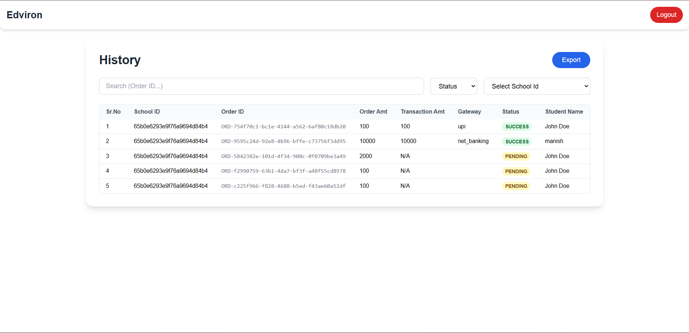
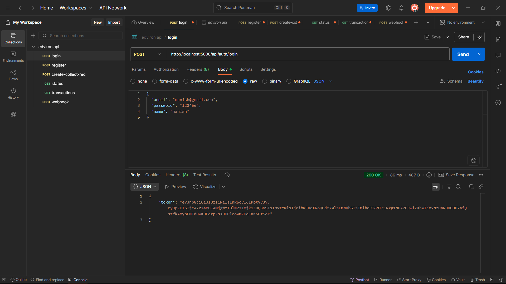
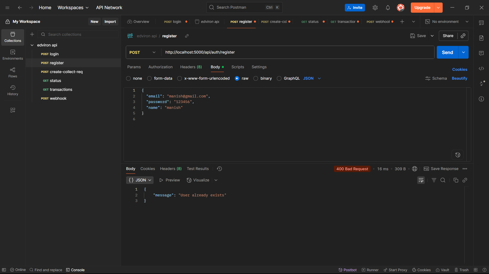
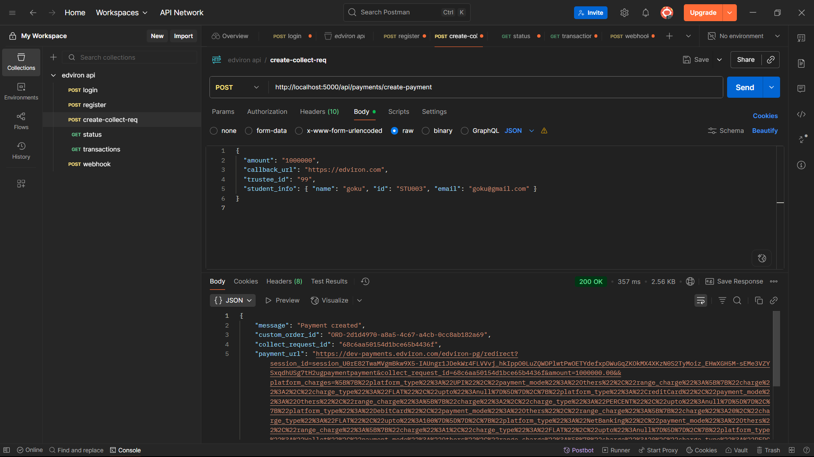
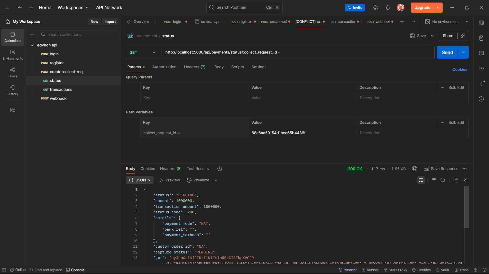
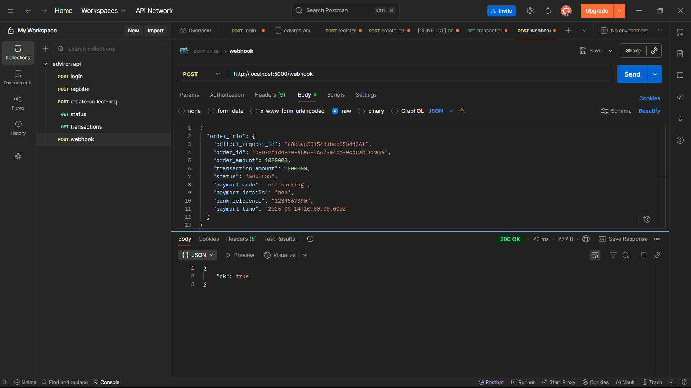
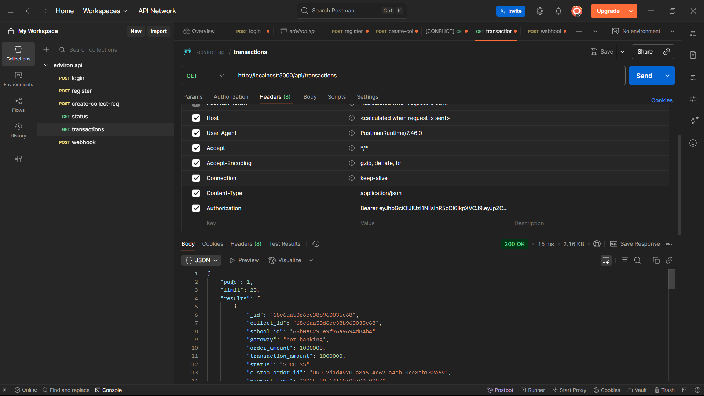

# 📖 Edviron Payments System  

    
    

---

## 📌 Overview  

A **full-stack payments system** integrated with **Edviron**.  
It allows:  

✅ Create Collect requests (payment links for students)  
✅ Real-time transaction updates via Webhooks  
✅ MongoDB persistence  
✅ dashboard with search + filters  

---

## 🖼️ Website Preview  

### 🔑 Login Page  
  

### 📂 Empty Storage (Before Login)  
  

### 📂 LocalStorage with AuthToken (After Login)  
  

### 📊 Payment History Dashboard  
  

---

## ⚙️ Setup & Installation  

### 1. Clone Repository  
```bash
git clone https://github.com/your-repo/edviron-payments.git
cd edviron-payments
```

### 2. Backend Setup  
```bash
cd backend
npm install
npm run dev
```

#### Backend `.env`  
```env
PORT=4000
MONGO_URI=mongodb://localhost:27017/edviron
EDVIRON_API_KEY=your_edviron_api_key
EDVIRON_PG_KEY=your_edviron_pg_key
JWT_SECRET=secret
JWT_EXPIRES_IN=7d
PG_CREATE_COLLECT_URL=https://dev-vanilla.edviron.com/erp/create-collect-request
PG_BASE_URL=https://dev-vanilla.edviron.com/erp
```

### 3. Frontend Setup  
```bash
cd frontend
npm install
npm run dev
```

Visit 👉 [http://localhost:5173](http://localhost:5173)  

---

## 📡 API Documentation  

### 1. Create Collect  
**POST** `/api/payments/create-collect-request`  

Request:  
```json
{
  "school_id": "65b0e6293e9f76a9694d84b4",
  "amount": "2000",
  "order_id": "ORDER123",
  "student_name": "manish",
  "phone": "9876543210",
  "callback_url" : edviron.com,
  "sign" : this is generated using jwt.sign({school_id,callback_url,amount},edviron_pg_key)
}
```

Response:  
```json
{
  "collect_id": "68c2a4cafe1ebb315a0bf662",
  "payment_url": "https://dev-vanilla.edviron.com/pay/...",
  "sign": "........"
}
```
### 2. collect-status (Payment Updates)  
**GET** `/api/payments/status/:collect_request_id`  

Payload Example:  
```json
{
  "payload": {
    "status": "success",
    "amount": 2000,
    "details": {
      ...
      ...
     },
     "jwt" : 
    
  }
}
```
---
### 3. Webhook (Payment Updates)  
**POST** `/api/webhook`  

Payload Example:  
```json
{
  "payload": {
    "order_id": "ORDER123",
    "collect_id": "68c2a4cafe1ebb315a0bf662",
    "transaction_amount": 2000,
    "status": "success"
  }
}
```

### 4. Transactions List  
**GET** `/api/transactions?page=1&limit=10`  

Response:  
```json
{
  "page": 1,
  "limit": 10,
  "totalPages": 3,
  "results": [
    {
      "collect_id": "68c2a4cafe1ebb315a0bf662",
      "order_amount": 2000,
      "transaction_amount": 2000,
      "status": "success",
      "payment_mode": "UPI",
      "student_name": "manish",
      "phone": "9876543210",
      "payment_time": "2025-09-11T12:34:56.000Z"
    }
  ]
}
```

---


👉 The backend updates the matching transaction in MongoDB.  

---

## 🔗 Postman Testing  

### Login  
  

### Register
  

### create collect request 
  

### collect status 


### Webhook


### Transaction


---

## 🎨 Frontend Features  

- ✅ Login system with JWT token stored in LocalStorage  
- ✅ Paginated transactions table  
- ✅ Search & filter support (status, school, date)  
- ✅ Row hover + status colors (🟢 success, 🟡 pending, 🔴 failed)  

---

## 🎥 Walkthrough  

Here’s how the flow works:  

### 1️⃣ Login  
User logs in with credentials.  
  

---

### 2️⃣ Before Login  
LocalStorage is empty → no authentication.  
  

---

### 3️⃣ After Login  
JWT AuthToken is stored in LocalStorage.  
  

---

### 4️⃣ Dashboard  
Transaction history is shown with pagination + filters.  
  

---

## ✅ Summary  

- **Backend:** Edviron integration + webhooks + MongoDB persistence  
- **Frontend:** Login + JWT handling + transactions UI  
- **Flow:** Login → Auth → Create Collect → Webhook Updates → Dashboard  

⚡ Clean, modern, and production-ready!  
